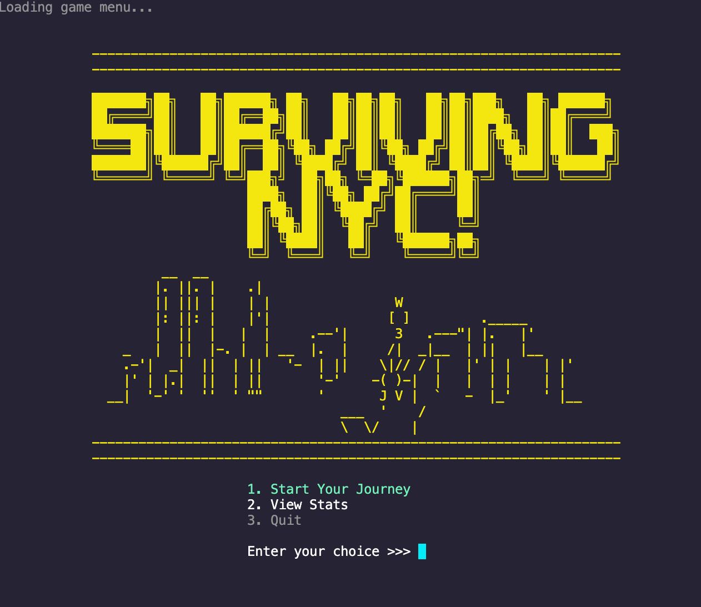

# PYTHON-GAME: Surviving NYC!

# Introduction 
Surviving NYC! is a Python 'choose your own adventure' game that simulates a first-person experience navigating through a day in New York City. The player is presented with a prompt and must select from a list of actions to determine the next event in the adventure. The decisions you make can lead you home at the end of the long day or to your final destination. Get ready to dodge the chaos of the city, face the consequences your actions, and learn if you have what it takes to survive in the Big Apple!

## Set Up
1. Clone the repository from GitHub Repo URL.

2. Navigate to the project directory.

3. Run the following commands inside the terminal

- `pipenv install`
- `pipenv shell`

## Imports
- import os
- import sys
- import sqlite3
- import subprocess
- import tabulate

## Core Features
- Interactive main menu with 3 selections
- Background sound activation when app is ran 
- When starting a game, you will be prompted to enter your username to start game.
- Displays statistics showing what choices were most popular among players. 

## Skills Learned
- How to query data using SQL to tracks the players behavior.
- Adding sound FX to options in menu